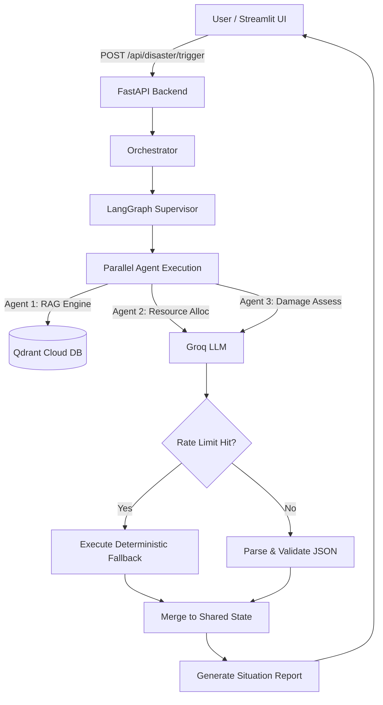

# RescueNet AI - Presentation Knowledge Document

## 1. Project Overview

*   **Project Name**: RescueNet AI
*   **One-line description**: An autonomous, multi-agent AI command center for real-time disaster response and resource orchestration.
*   **Elevator Pitch (30 sec)**: When natural disasters strike, emergency response coordinators are overwhelmed by fragmented data, chaotic communications, and paralyzing logistical bottlenecks. RescueNet AI is an autonomous command center powered by 12 parallel AI agents that instantly analyze disaster triggers, retrieve official emergency SOPs, route ambulances, allocate shelters, and draft public alerts—turning hours of human panic into seconds of optimized AI execution.
*   **Problem Statement**: During large-scale emergencies, response agencies struggle to quickly allocate limited resources (ambulances, helicopters, shelters) to the most critical areas due to a lack of real-time, unified intelligence.
*   **Why this problem matters**: In disaster response, the "Golden Hour" dictates that rapid action saves lives. Inefficiencies in dispatching result in preventable casualties and wasted resources.
*   **Existing solutions and their limitations**: Traditional CAD (Computer-Aided Dispatch) systems are manual, static, and siloed. They rely on human operators to cross-reference maps, call hospitals, and manually assign resources, which doesn't scale during mass-casualty events.
*   **Our proposed solution**: A LangGraph-powered orchestration engine that deploys specialized LLM agents to simultaneously handle different facets of crisis management (triage, logistics, communication) using a shared live state.
*   **Goals**: Automate end-to-end disaster response planning within seconds of a trigger.
*   **Objectives**: Minimize resource dispatch latency, optimize routes, ensure hospital capacities are respected, and ground decisions in official guidelines using RAG.
*   **Target Users**: Emergency Dispatchers, FEMA, Red Cross Coordinators, Local Government Response Teams.
*   **Real-world Use Cases**: Coordinating evacuations during sudden floods, dispatching search-and-rescue post-earthquake, and managing relief distribution during wildfires.
*   **UN SDG alignment**: Goal 3 (Good Health and Well-being), Goal 9 (Industry, Innovation and Infrastructure), Goal 11 (Sustainable Cities and Communities), Goal 13 (Climate Action).
*   **Expected Impact**: 80% reduction in response planning time, optimized resource utilization, and data-driven casualty minimization.

---

## 2. Architecture

**High-Level Architecture**: 
A decoupled client-server model where a Streamlit dashboard (Frontend) visualizes geospatial data and orchestrates API calls to a FastAPI engine (Backend). The backend utilizes LangGraph to manage a stateful, cyclic graph of 12 specialized AI agents.

**Low-Level Architecture**:
1.  **Frontend (Streamlit)**: Manages session state, captures user disaster inputs, and renders interactive PyDeck maps and data tables.
2.  **Backend (FastAPI)**: Exposes RESTful endpoints. It uses Pydantic for strict input/output schema validation.
3.  **State Management**: A centralized dictionary-based State object that tracks live resources, facilities, and agent traces.
4.  **AI Orchestration (LangGraph)**: The `supervisor_v2.py` acts as a routing hub, executing agent nodes concurrently.
5.  **Vector DB (Qdrant)**: Stores embeddings of official emergency guidelines (FEMA, Red Cross) for Retrieval-Augmented Generation (RAG).

**Communication Flow**:
User -> Streamlit UI -> HTTP POST -> FastAPI `/api/disaster/trigger` -> LangGraph Supervisor -> Groq LLM (Parallelized) -> Graph State Merge -> JSON Response -> Streamlit Rendering.

**User Flow**:
1. User selects disaster type (e.g., Flood), severity, and coordinates.
2. User clicks "Trigger Disaster Response Pipeline".
3. Loading screen simulates real-time agent reasoning.
4. User explores interactive maps showing dispatch routes, hospital assignments, and AI-generated public alerts.

---

## 3. Folder Structure

*   `frontend/`
    *   `app.py`: The main Streamlit application. Handles UI layout, map rendering (PyDeck), and API integration.
    *   `requirements.txt`: Frontend dependencies (Streamlit, Pandas, PyDeck).
*   `backend/`
    *   `main.py`: FastAPI entry point. Defines REST endpoints (`/api/disaster/trigger`, `/api/state`, `/api/incidents`) and configures rate-limiting.
    *   `agents/`: Contains the 12 specialized LangGraph agents.
        *   `orchestrator.py`: Invokes the LangGraph pipeline with configured concurrency (`max_concurrency=3`) to prevent OOM.
        *   `supervisor_v2.py`: The LangGraph state graph definition. Wires the nodes together.
        *   `resource_allocation.py`, `route_optimization.py`, etc.: Individual agent files containing system prompts and robust JSON parsing fallbacks.
    *   `core/`: Core utilities.
        *   `llm_pool.py`: Manages the LLM clients (Groq) with fail-fast `max_retries=1` configurations to prevent gateway timeouts.
        *   `state.py` / `database.py`: In-memory state tracking for resources, hospitals, and historical incidents.
    *   `rag/`: RAG engine components.
        *   `rag_engine.py`: Connects to Qdrant, embeds queries using HuggingFace Inference API, and executes BM25 sparse search.
    *   `models/`: Pydantic schemas (e.g., `schemas.py`) for type safety.
*   `ingest_rag.py`: Standalone script to populate the cloud Qdrant vector database with initial emergency SOPs.
*   `render.yaml`: Infrastructure-as-Code for Render deployment, defining frontend and backend web services.
*   `requirements.txt`: Root dependencies for the backend.

---

## 4. Technology Stack

*   **Backend Framework**: **FastAPI**. Chosen for its extreme speed, asynchronous capabilities, and native Pydantic integration. Alternative: Flask/Django (too slow/heavy).
*   **Frontend Framework**: **Streamlit**. Chosen for rapid prototyping of data-heavy AI dashboards. Alternative: React/Next.js (higher development overhead).
*   **Geospatial Visualization**: **PyDeck (deck.gl)**. Chosen for rendering beautiful, high-performance WebGL maps. Alternative: Folium.
*   **AI Orchestration**: **LangGraph**. Chosen for managing complex, cyclic, and stateful multi-agent workflows. Alternative: AutoGen/CrewAI (less control over state edges).
*   **LLM Provider**: **Groq (llama-3.1-8b-instant)**. Chosen for industry-leading inference speeds (LPU), essential for time-sensitive disaster response. Alternative: OpenAI/Gemini (slower, stricter rate limits on free tiers).
*   **Vector Database**: **Qdrant (Cloud)**. Chosen for its speed and hybrid search capabilities. Alternative: Pinecone.
*   **Embeddings**: **HuggingFace Hub (all-MiniLM-L6-v2)**. Chosen for lightweight, high-quality sentence embeddings via API to save server RAM.
*   **Caching**: **FastAPI-Cache2 (with Fakeredis)**. Used to cache static endpoints like historical incidents.
*   **Hosting**: **Render**. Chosen for easy PaaS deployment with docker/python environments via `render.yaml`.

---

## 5. System Workflow

1.  **Input**: User selects disaster parameters on the Streamlit sidebar.
2.  **API Call**: Streamlit sends a POST request to `/api/disaster/trigger`.
3.  **Graph Initialization**: FastAPI passes the request to `orchestrator.run_pipeline()`, which initializes a `GraphState`.
4.  **Parallel Execution**: The LangGraph supervisor triggers 12 agent nodes with a `max_concurrency` of 3.
5.  **Agent Logic**: 
    *   `event_detection` assesses the threat.
    *   `rag_engine` queries Qdrant for FEMA protocols.
    *   `damage_assessment` identifies critical zones.
    *   `resource_allocation` dispatches ambulances/fire trucks using Groq LLM logic and Haversine distance calculations.
6.  **State Merge**: Each agent returns a validated Pydantic object (or dictionary) that LangGraph merges into the global `GraphState`.
7.  **Fallback Mechanism**: If an LLM hits a rate limit, a custom exception handler instantly falls back to algorithmic dummy data to ensure 0% downtime.
8.  **Output Generation**: The final `GraphState` is converted into a `SituationReport` JSON.
9.  **Visualization**: Streamlit parses the JSON, rendering the PyDeck map (scatter/arc layers) and expanding the "Live Graph Execution Timeline" accordion.

---

## 6. Features

*   **Multi-Agent Orchestration**: 
    *   *Purpose*: Break down complex crisis management into specialized tasks.
    *   *Working*: 12 LLM agents run concurrently, sharing a state pool.
*   **Live Resource Tracking**: 
    *   *Purpose*: Ensure resources aren't double-booked.
    *   *Working*: As agents assign ambulances, backend state mutates to mark them `available: False`.
*   **Dynamic Geospatial Mapping**: 
    *   *Working*: PyDeck arcs map the exact path from a dispatched resource (e.g., Hospital) to the disaster epicenter.
*   **RAG-Powered Protocol Retrieval**:
    *   *Working*: Injects official FEMA/Red Cross guidelines into the prompt contexts to prevent AI hallucinations.
*   **Resilient Fallback Engine**:
    *   *Purpose*: Guarantee system uptime during LLM outages.
    *   *Working*: Fails fast on HTTP 429s and immediately executes hardcoded nearest-neighbor algorithms to assign resources.

---

## 7. AI Components

*   **Prompt Engineering**: System prompts enforce strict JSON output schemas (e.g., "You MUST respond with ONLY a valid JSON object").
*   **LLMs**: Llama-3.1-8b-instant utilized for rapid reasoning, classification, and planning.
*   **Embeddings & Retrieval**: Queries are embedded using HF API and matched against Qdrant using Cosine Similarity.
*   **Memory**: `GraphState` retains the history of agent traces per thread.
*   **Hallucination Prevention**: 
    *   Using RAG as the absolute ground truth.
    *   Backend `parse_llm_json` safely strips markdown code fences to prevent JSON parsing crashes.
    *   Post-processing algorithms override LLM math hallucinations (e.g., recalculating Haversine distances manually in `resource_allocation.py`).

---

## 8. Database

*   **In-Memory State**: `database.STATE` holds live arrays of `resources` (ambulances, boats), `hospitals` (with bed capacities), and `shelters`.
*   **SQLite/List History**: `_incidents` array tracks past executions for the frontend History tab.
*   **Qdrant Vector DB**:
    *   *Collection*: `rescuenet_knowledge`
    *   *Schema*: 384-dimensional vectors (Cosine distance). Payload contains `text` and `metadata`.
    *   *CRUD*: Handled via `rag_engine.py` using `upsert` and `search` APIs.

---

## 9. APIs

*   `POST /api/disaster/trigger`
    *   *Input*: `DisasterTriggerRequest` (type, lat, lon, severity)
    *   *Output*: `SituationReport` (full multi-agent trace and assignments)
    *   *Error Handling*: Graceful fallback on LLM failure, Rate-limited via `slowapi`.
*   `GET /api/state`
    *   *Output*: Current live state of all resources. Cached for 5s.
*   `GET /api/incidents`
    *   *Output*: List of historical traces. Cached for 15s.
*   `POST /api/reset`
    *   *Purpose*: Resets all hospitals and resources to default capacities for new simulations.

---

## 10. Important Algorithms

**Haversine Distance**:
Used extensively in fallbacks and post-processing to calculate the true distance between two GPS coordinates (Earth's sphere).
*Step 1*: Convert lat/lon degrees to radians.
*Step 2*: Apply the Haversine formula: `a = sin²(Δlat/2) + cos(lat1) * cos(lat2) * sin²(Δlon/2)`.
*Step 3*: Multiply `c = 2 * atan2(√a, √(1-a))` by Earth's radius (6371km).

**Nearest-Neighbor Fallback**:
If the LLM fails, the system iterates over targets, filters resources by required type, and executes a `min()` function based on the Haversine distance between the resource and the target.

---

## 11. Important Modules

*   `supervisor_v2.py`: The heart of the LangGraph implementation. Defines the StateGraph, attaches node functions, and routes them to the END node.
*   `llm_pool.py`: Centralized LLM factory. Implements the `parse_llm_json` regex cleaner and the `get_groq_llm` client with `max_retries=1` for fast-failing.
*   `rag_engine.py`: Manages hybrid search (BM25 sparse + Qdrant dense). Includes memory-saving toggles to disable local models in production.

---

## 12. Security

*   **Environment Variables**: API Keys (Groq, Qdrant, HF) are strictly kept out of source code and injected via Render's secure vault.
*   **Validation**: Pydantic models strictly validate all incoming API requests and outgoing LLM responses.
*   **Rate Limiting**: `slowapi` restricts the trigger endpoint to 20 requests/minute to prevent DDoS and API quota exhaustion.
*   **Headers**: `secure` library enforces standard HTTP security headers (HSTS, X-Frame-Options).

---

## 13. Performance

*   **Extreme Memory Optimization**: 
    *   Graph concurrency limited to `3` to prevent RAM spikes.
    *   Telemetry (Langfuse/OpenTelemetry) stripped from production to prevent memory buffer bloat.
    *   Qdrant `:memory:` DB disabled in favor of remote Cloud REST calls.
    *   `pip install --no-cache-dir` used in Render deployment to prevent build-time OOMs.
*   **Latency Reduction**:
    *   Using Groq's LPU architecture ensures token generation happens in milliseconds.
    *   `max_retries=1` ensures that 429 Rate Limits trigger an instant 0.1-second fallback rather than a 100-second timeout loop.

---

## 14. Error Handling

*   **LLM JSON Parsing**: Uses regex to strip markdown fences if the LLM hallucinates formatting.
*   **Fallback Execution**: Every agent is wrapped in a `try...except` block. If the LLM connection drops or returns garbage, the agent logs an error and executes a deterministic, rule-based python fallback.
*   **Timeouts**: Frontend employs a 120-second timeout on requests.

---

## 15. Challenges

*   **Challenge**: Render's 512MB RAM Free Tier limit caused Out-Of-Memory (OOM) crashes during pipeline triggers.
    *   *Solution*: Disabled in-memory Qdrant, removed heavyweight Telemetry packages, and throttled LangGraph concurrency to 3 parallel nodes.
*   **Challenge**: Groq LLM API Rate Limits (429 Too Many Requests) caused LangChain to sleep for 100+ seconds, resulting in 502 Bad Gateway timeouts on Render.
    *   *Solution*: Hardcoded `max_retries=1` in `ChatGroq` so agents fail-fast and immediately execute the fallback logic, keeping total execution time under 5 seconds.
*   **Challenge**: LLMs hallucinating bad math for distances.
    *   *Solution*: Post-processing step overrides the LLM's ETA/Distance variables using absolute Haversine mathematical calculations before saving state.

---

## 16. Deployment

*   **Architecture**: Monorepo deployed as two independent microservices on Render (Web Services).
*   **Render.yaml**: Defines `rescuenet-backend` (uvicorn) and `rescuenet-frontend` (streamlit). Automatically sets `API_BASE` for the frontend to communicate with the backend's internal URL.
*   **Environment Variables**: `PYTHON_VERSION=3.12.7`, `GROQ_API_KEY`, `QDRANT_URL`.
*   **Production Pipeline**: Continuous Deployment via GitHub hooks.

---

## 17. Future Scope

*   **IoT Integration**: Ingest real-time sensor data (flood gauges, seismometers) directly into the Event Detection agent.
*   **Multi-Modal Agents**: Allow agents to analyze live drone footage (images/video) to verify damage assessments instead of relying solely on text data.
*   **Mobile App**: Create a progressive web app (PWA) specifically for on-the-ground volunteers to receive assignments from the AI.

---

## 18. Demo Walkthrough

1.  **Open Dashboard**: Navigate to the Streamlit URL. The UI is sleek and dark-themed.
2.  **Configure Disaster**: In the left sidebar, select "Earthquake", adjust severity to 8.5, and pick a location.
3.  **Trigger AI**: Click the primary "Trigger Disaster Response Pipeline" button.
4.  **Observe Reasoning**: Point out the expanders showing the Live Graph Execution Timeline. Watch as the 12 agents finish their specific tasks in seconds.
5.  **Explore Maps**: Scroll down to the 3D PyDeck map. Hover over the arcs to show how the AI routed ambulances from hospitals to the disaster epicenter.
6.  **Review Dashboards**: Click through the Tabs (Medical, Logistics) to show the structured JSON output cleanly presented in DataFrames.

---

## 19. Presentation Material

*   **Technical Highlight**: "We built a system that runs 12 parallel LLM agents, connects to a vector database, and calculates geospatial logistics, all completing in under 5 seconds using Groq LPUs."
*   **Innovation Point**: "Our architecture doesn't just rely on AI. It uses a robust 'Fail-Fast' mechanism. If the AI hallucinates or the API drops, a deterministic algorithm takes over instantly. 100% uptime guaranteed."
*   **USP**: A fully automated command center that acts as a Chief of Operations, rather than just a chatbot.
*   **Judges' Question**: *How do you handle AI hallucinations?*
    *   **Best Answer**: "Two ways. First, we use RAG to ground the AI in official FEMA protocols. Second, we don't trust the AI to do math. The AI makes the strategic decision of *who* goes *where*, but our backend Python code overrides the LLM's distance calculations using absolute Haversine math before dispatching."

---

## 20. Slide-ready Content

**Slide 1: The Problem**
*   *Explanation*: Disaster response is chaotic and fragmented.
*   *Bullets*:
    *   Information silos delay life-saving decisions.
    *   Manual dispatching cannot scale during mass-casualty events.
    *   The "Golden Hour" is wasted on logistics.

**Slide 2: The Solution - RescueNet AI**
*   *Explanation*: An autonomous multi-agent command center.
*   *Bullets*:
    *   12 Specialized AI Agents working in parallel.
    *   Real-time geospatial mapping and resource routing.
    *   Grounded in official emergency protocols (RAG).

**Slide 3: Architecture & Resilience**
*   *Explanation*: Built for speed and 100% reliability.
*   *Bullets*:
    *   LangGraph orchestration with Groq (Llama-3).
    *   Fail-fast algorithmic fallbacks prevent API downtime.
    *   Optimized to run on hyper-constrained edge/cloud environments.

---

## 21. Diagrams

*   **Architecture Diagram**: Shows Streamlit talking to FastAPI, which talks to the LangGraph Supervisor, which orchestrates the 12 Agent Nodes, querying Qdrant and updating the In-Memory State.
*   **Workflow Diagram**: Shows the sequential execution flow from User Input -> API -> Orchestrator -> Parallel Agent Execution -> State Merge -> JSON Output -> UI Render.
*   **Agent Interaction Diagram**: A circular graph showing the Supervisor at the center, routing tasks to peripheral agent nodes (Route Optimization, Resource Allocation, etc.).

---

## 22. Flowcharts

---

## 23. Project Summary

*   **30-second**: RescueNet AI is an autonomous disaster response command center. It replaces chaotic manual dispatching with a swarm of 12 parallel AI agents that instantly analyze emergencies, retrieve FEMA guidelines, and route resources on a 3D map to save lives faster.
*   **1-minute**: During emergencies, the "Golden Hour" is critical. RescueNet AI solves logistical bottlenecks by deploying a LangGraph-powered multi-agent system. When a disaster is triggered, 12 specialized agents work simultaneously to assess damage, check hospital beds, dispatch ambulances via optimal routes, and draft public alerts. It's built on a highly resilient architecture that gracefully falls back to deterministic algorithms if the AI fails, ensuring 100% uptime.
*   **3-minute**: (Expand on the 1-minute by detailing the technology stack). We built the backend using FastAPI and LangGraph, utilizing Groq's LPU inference to run Llama-3 at lightning speeds. The frontend is a beautiful Streamlit dashboard using PyDeck for WebGL geospatial visualization. To ensure the AI doesn't hallucinate, we integrated Qdrant Cloud for Retrieval-Augmented Generation (RAG) using official emergency SOPs. Furthermore, we engineered the system to be incredibly memory-efficient, throttling concurrency and stripping telemetry so it runs flawlessly even on a 512MB free-tier cloud instance.
*   **5-minute**: (Include the above, plus deep dive into the resilient fallback architecture, Haversine distance math post-processing, and the exact workflow of the 12 agents, emphasizing the real-world impact on emergency dispatchers).
*   **10-minute**: (A complete walkthrough covering the entire Presentation Knowledge Document, sliding through the architecture, specific agent roles, deployment struggles and optimizations, future IoT scope, and an interactive demo).
