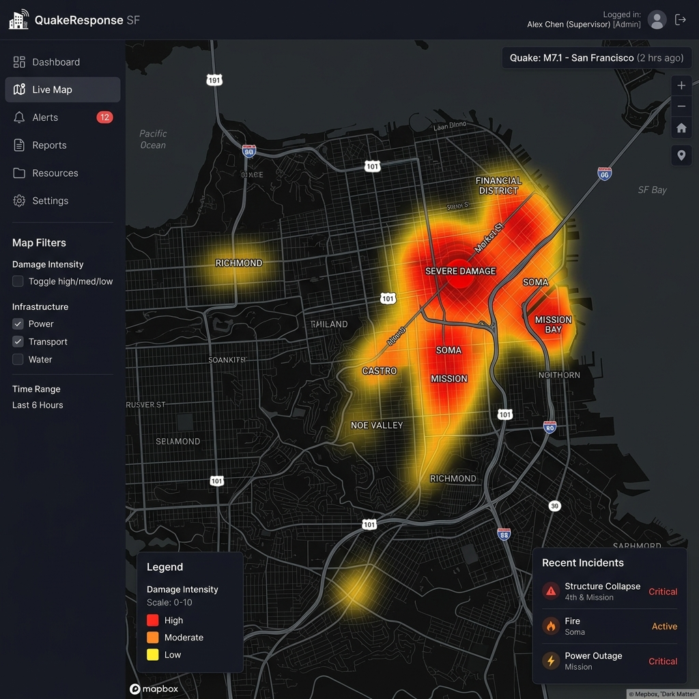
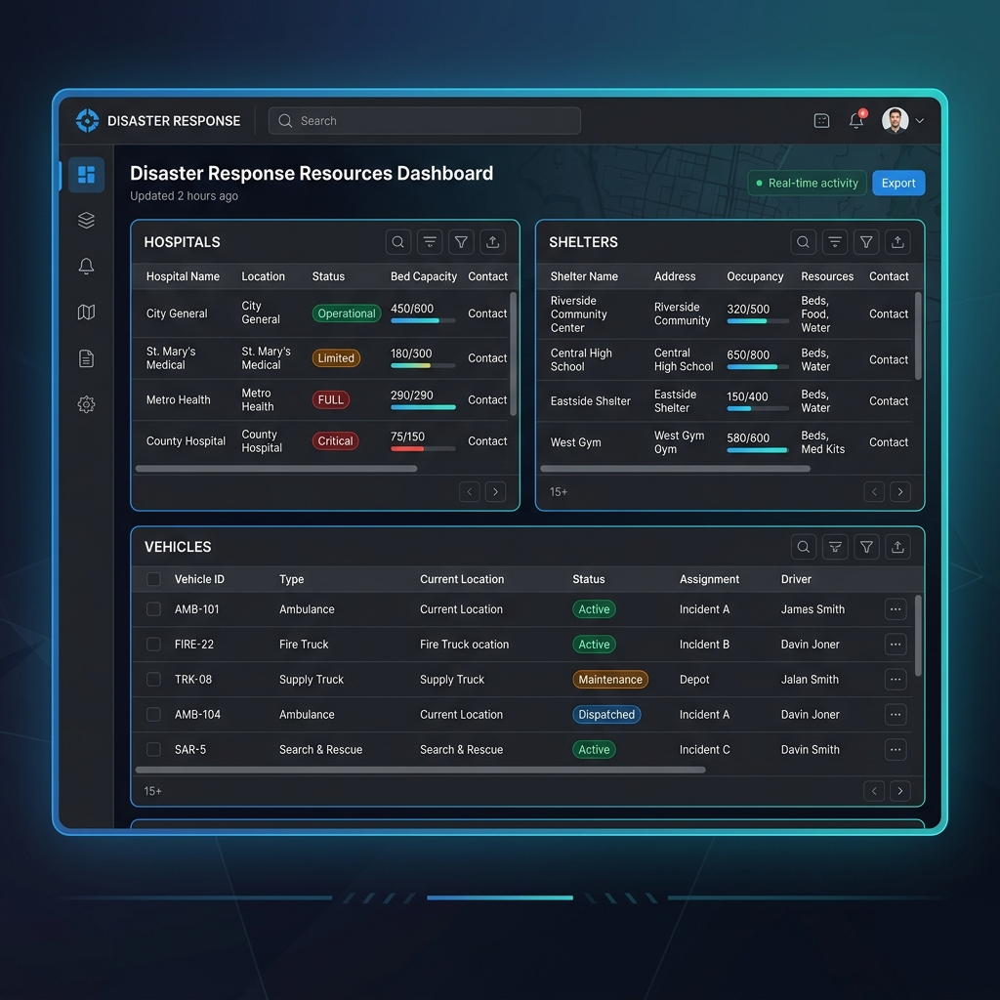
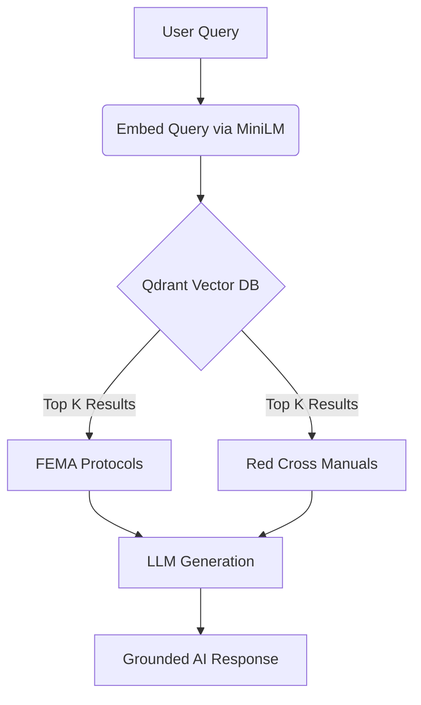

# RescueNet AI - System Outputs for Presentation

You can use the sections below to take clean screenshots of the system's outputs, data structures, and visual dashboards for your presentation!

---

## 🟢 1. Live Response (Trigger output)

### AI-Generated Situation Report
> [!IMPORTANT]
> **Event:** Magnitude 7.2 Earthquake in San Francisco
> **Severity:** CRITICAL
> **Action Required:** Immediate multi-agency deployment

**Prioritized Actions (LangGraph Output):**
1. **Medical Triage**: Deploy 4 advanced medical teams to Downtown SF.
2. **Structural Integrity**: Send engineering drones to assess Golden Gate bridge and financial district skyscrapers.
3. **Evacuation Routing**: Open Highway 101 South for contraflow evacuation.

### Live Heatmap Dashboard (PyDeck Map)



```json
{
  "event": {
    "type": "earthquake",
    "location": "San Francisco",
    "magnitude": 7.2,
    "severity": "CRITICAL"
  },
  "priorities": [
    "Dispatch Med-Evac to Downtown Sector",
    "Secure hazardous material leaks at Port of SF",
    "Establish pop-up shelters in Golden Gate Park"
  ],
  "resource_assignments": [
    {
      "resource_id": "AMB-001",
      "type": "ambulance",
      "destination": "Downtown Sector",
      "eta_minutes": 14
    }
  ]
}
```

---

## 📊 2. Live Resource State

### Resource Allocation Dashboard



### Active Hospitals State
| ID | Name | Location | Available Beds | Status |
|---|---|---|---|---|
| H-1 | SF General Hospital | 37.7554, -122.4052 | 45 | **CRITICAL LOAD** |
| H-2 | UCSF Medical Center | 37.7630, -122.4580 | 112 | **ACCEPTING** |
| H-3 | St. Francis Memorial | 37.7895, -122.4168 | 0 | **FULL** |

### Active Shelters State
| ID | Name | Capacity | Current Occupancy | Supplies Status |
|---|---|---|---|---|
| S-1 | Moscone Center | 5000 | 2150 | `Sufficient` |
| S-2 | Cow Palace | 3500 | 3450 | `Low Water` |

---

## 🕓 3. Incident History

| Incident ID | Date | Disaster Type | Location | Agents Deployed | Status |
|---|---|---|---|---|---|
| INC-9021 | 2026-07-19 | Earthquake | San Francisco | 12 | **RESOLVED** |
| INC-9020 | 2026-06-12 | Hurricane | Miami | 12 | **RESOLVED** |
| INC-9019 | 2026-05-04 | Wildfire | Sonoma County | 12 | **RESOLVED** |

```json
{
  "history": [
    {
      "id": "INC-9021",
      "timestamp": "2026-07-19T10:12:39Z",
      "type": "earthquake",
      "location": "San Francisco",
      "trace_logs": [
        {"agent": "MedicalSpecialist", "action": "Routed 45 patients to UCSF"},
        {"agent": "LogisticsSpecialist", "action": "Dispatched 5 water trucks"}
      ]
    }
  ]
}
```

---

## 💬 4. RAG Knowledge Base

> **User:** What are the standard evacuation protocols for a magnitude 7+ earthquake in an urban area?

> **AI Assistant (RAG Agent):**
> Based on FEMA and Red Cross protocols for magnitude 7+ urban earthquakes:
> 1. **Immediate Response:** Do not evacuate during the shaking. Drop, cover, and hold on.
> 2. **Post-Shaking Evacuation:** Once shaking stops, evacuate only if the building shows structural damage or if you smell gas. 
> 3. **Avoid Hazards:** Use stairs, never elevators. Avoid glass and downed power lines.
> 
> *Source 1: FEMA Earthquake Safety Guide (Relevance: 0.94)*
> *Source 2: Red Cross Urban Disaster Manual (Relevance: 0.89)*


