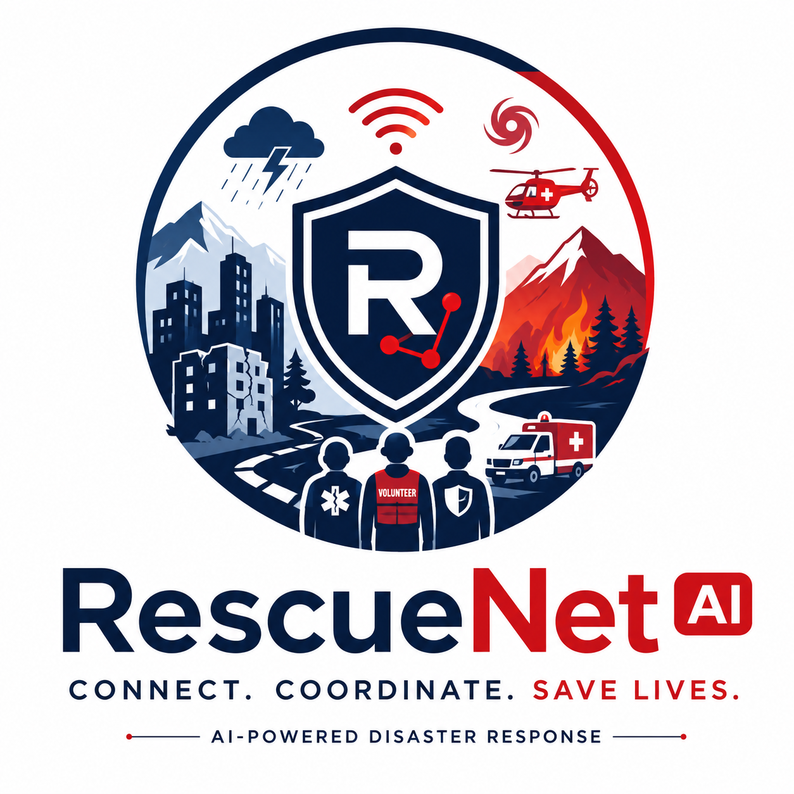
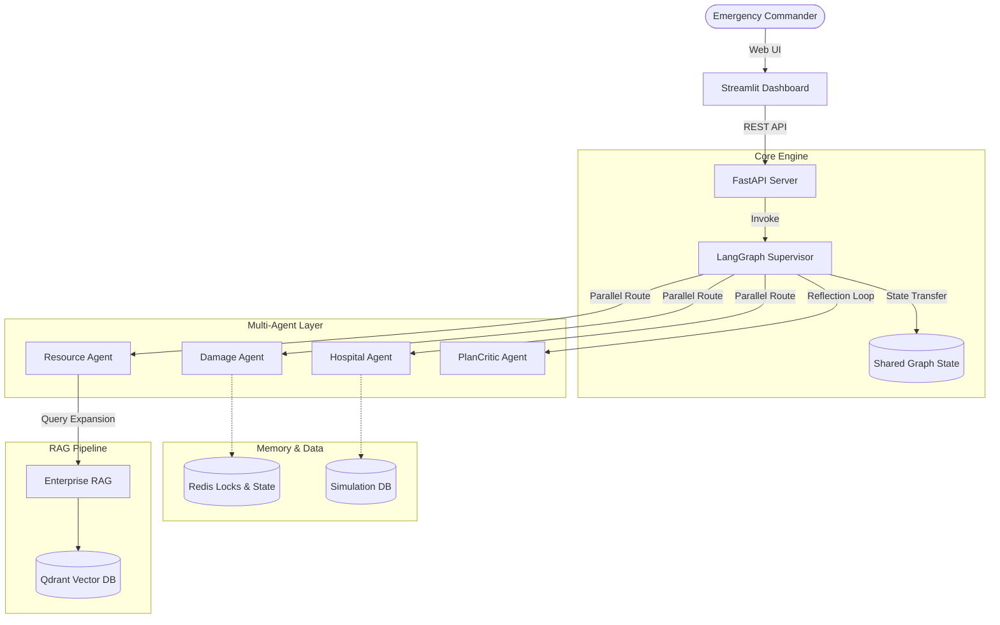
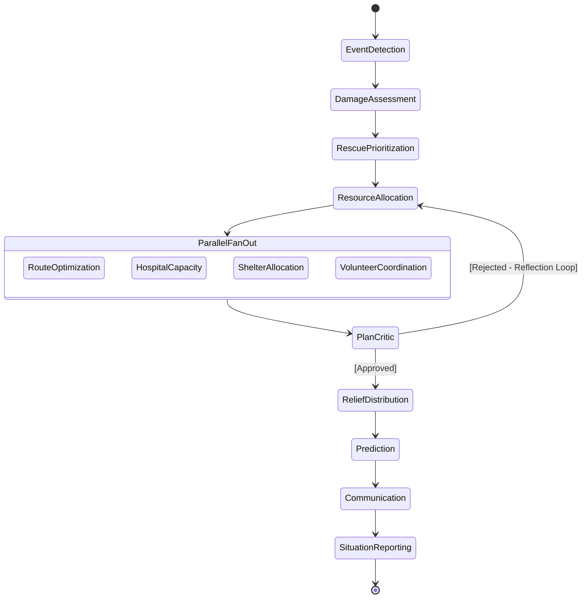
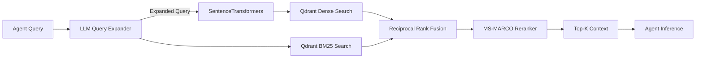

<div align="center">
  
  <h1>RescueNet AI</h1>
  <p><em>Autonomous Multi-Agent Command Center for Disaster Orchestration</em></p>

  [](https://www.python.org/downloads/)
  [](https://fastapi.tiangolo.com/)
  [](https://langchain-ai.github.io/langgraph/)
  [](https://www.docker.com/)
  [](https://redis.io/)
  [](https://qdrant.tech/)
  [](https://opensource.org/licenses/MIT)

</div>

---

## Executive Summary

**RescueNet AI** is an enterprise-grade autonomous orchestration platform built to solve the catastrophic coordination silos that occur during large-scale natural disasters. 

When a disaster strikes, hospitals, emergency responders, shelters, and volunteer organizations often operate independently, leading to massive inefficiencies, delayed responses, and lost lives. RescueNet AI solves this by introducing a **Multi-Agent AI Architecture**. 

Instead of humans manually calling different agencies, RescueNet AI acts as a central **LangGraph Supervisor**, dynamically orchestrating 12 specialized AI agents (Damage Assessment, Hospital Capacity, Route Optimization, etc.) in a highly concurrent, human-in-the-loop pipeline. Utilizing **Enterprise RAG** (Hybrid Search + Cross-Encoders) over FEMA protocols and live disaster telemetry, the platform generates real-time, context-grounded resource deployments.

**Impact & SDG Alignment:**
- 🌍 **SDG 11 (Sustainable Cities and Communities)**: Enhances urban resilience against extreme weather events.
- 🌡️ **SDG 13 (Climate Action)**: Adapts critical infrastructure response to climate-induced anomalies.

---

## Key Features

| Capability | Description | Status |
| :--- | :--- | :---: |
| 🤖 **Multi-Agent AI** | 12 specialized LLM agents (Groq/Llama-3) executing distinct rescue domains. | ✅ |
| 🕸️ **LangGraph Workflow** | Directed Acyclic Graph (DAG) state orchestration with Reflection loops. | ✅ |
| 🧠 **Supervisor Agent** | Dynamic routing of concurrent sub-agents with strict output validation. | ✅ |
| 💾 **Shared Graph State** | Immutable Pydantic-typed state shared across distributed nodes. | ✅ |
| 🔍 **Enterprise RAG** | Qdrant Vector DB with BM25 + Dense Hybrid Search and Cross-Encoders. | ✅ |
| 📚 **Memory Architecture** | Redis-backed distributed locks and LangGraph checkpointing. | ✅ |
| 🛑 **Human-in-the-loop** | Manual approval checkpoints for sensitive resource allocations. | ✅ |
| 📊 **Real-Time Dashboard** | Streamlit command center with dynamic metrics and execution timelines. | ✅ |
| 🗺️ **Interactive Maps** | PyDeck 3D visualizations (Heatmaps, Scatterplots, Arcs) of the disaster zone. | ✅ |
| 🐳 **Docker Deployment** | Production-ready multi-container orchestration. | ✅ |
| 🔭 **Observability** | OpenTelemetry traces and structured JSON logging. | ✅ |

---

## System Architecture

RescueNet AI is designed as a distributed, stateless REST API supported by a Redis working memory layer.



**Component Breakdown:**
1. **Frontend**: Streamlit dashboard acting as the commander's viewport.
2. **Backend**: FastAPI providing async endpoints, caching, and rate limiting.
3. **Supervisor**: LangGraph orchestrator evaluating state and determining the next agent execution.
4. **Specialist Agents**: LangChain-powered nodes wrapping Groq inference for strict Pydantic parsing.
5. **Memory**: Redis acts as the LangGraph checkpoint saver (for HITL) and distributed locking manager.
6. **RAG**: Qdrant handles semantic retrieval of emergency operating procedures.

For deeper architectural details, see [docs/ARCHITECTURE.md](docs/ARCHITECTURE.md).

---

## LangGraph Workflow

RescueNet AI does not execute sequentially. It builds a state graph to allow high-concurrency parallel tasks (e.g., Hospital checking and Shelter allocation run simultaneously) while ensuring dependent tasks (e.g., Routing cannot occur until Resources are allocated) wait their turn.



For complete workflow schemas, see [docs/LANGGRAPH_WORKFLOW.md](docs/LANGGRAPH_WORKFLOW.md).

---

## AI Agent Architecture

| Agent | Purpose | Reasoning Engine | Output Constraint | Tooling |
|:---|:---|:---|:---|:---|
| **Supervisor** | Orchestrates routing | Static Logic | `List[NextNodes]` | None |
| **PlanCritic** | Reflection & replanning | Groq Llama-3 | `APPROVE` / `REJECT` | Validation Rules |
| **Event Detection** | Classifies incoming trigger | Groq Llama-3 | `DisasterEvent` | `geocode_location` |
| **Damage Assessor** | Simulates spatial damage | Groq Llama-3 70B | `List[DamageReport]` | `query_osm` |
| **Prioritization** | Triages severity vs targets | Groq Llama-3 | `List[PriorityItem]` | `fetch_vulnerability`|
| **Resource Allocator**| Pairs fleet to targets | Groq Llama-3 70B | `List[ResourceAssignment]`| `calculate_eta` |
| **Route Optimizer** | Adjusts paths for blockages | Groq Llama-3 | `List[RouteInfo]` | `live_traffic` |
| **Hospital Capacity** | Routes casualties to beds | Groq Llama-3 | `List[HospitalAssignment]`| `fetch_telemetry` |
| **Shelter Allocator** | Routes displaced persons | Groq Llama-3 | `List[ShelterAssignment]` | `shelter_conditions`|
| **Volunteers** | Semantic skill matching | Groq Llama-3 70B | `List[VolunteerAssignment]`| `waiver_status` |
| **Communication** | Multilingual alerts | Groq Llama-3 70B | `List[Alert]` | `sms_gateway` |
| **Prediction (ReAct)**| Extrapolates disaster spread | Groq Llama-3 | `List[Forecast]` | `fetch_weather` |
| **Situation Report** | Executive summary | Groq Llama-3 70B | `String (Markdown)` | `historical_data` |

See [docs/AI_AGENTS.md](docs/AI_AGENTS.md) for individual prompt architectures and fallback behaviors.

---

## Enterprise RAG Architecture

RescueNet AI implements an advanced Retrieval-Augmented Generation pipeline.



Read more in [docs/RAG_DESIGN.md](docs/RAG_DESIGN.md).

---

## Memory Architecture

To prevent race conditions during high-concurrency parallel agent execution, RescueNet relies heavily on a dual-memory system:

1. **Working Memory (Redis Locks)**: Shared resources (e.g., Ambulances, ICU beds) are mutated using `RedisMemoryManager`. When the `HospitalCapacity` agent claims an ICU bed, it obtains a distributed lock, preventing the `ShelterAllocator` or other agents from reading stale state.
2. **Checkpoint Memory (LangGraph Saver)**: The graph state is serialized and `HSET` into Redis at every node transition, allowing operators to pause, inspect, and approve state modifications (HITL) without losing the session if the ASGI server restarts.

Read more in [docs/MEMORY_ARCHITECTURE.md](docs/MEMORY_ARCHITECTURE.md).

---

## Technology Stack

| Category | Technologies |
|:---|:---|
| **Frontend** | Streamlit, PyDeck, Plotly |
| **Backend** | FastAPI, Uvicorn, Pydantic, Gunicorn |
| **AI Orchestration** | LangGraph, LangChain, Groq API (Llama-3.1/3.3) |
| **Vector Database** | Qdrant (Local Docker instance) |
| **Caching/Memory** | Redis, FastAPI-Cache2 |
| **Simulation DB** | SQLite (Thread-safe singleton) |
| **Observability** | OpenTelemetry, Structured JSON Logging |
| **Testing** | Pytest, Pytest-Asyncio, Pytest-Cov |

---

## API Overview

The backend exposes a fully documented REST API (OpenAPI/Swagger available at `/docs`).

**Key Endpoint:** `/api/disaster/trigger`
- **Purpose**: Initiates the LangGraph multi-agent pipeline.
- **Request**:
```json
{
  "disaster_type": "flood",
  "location_name": "Delhi NCR",
  "lat": 28.6139,
  "lon": 77.2090
}
```
- **Response**: Streams SSE (Server-Sent Events) returning real-time LangGraph state updates.

See [docs/API_REFERENCE.md](docs/API_REFERENCE.md) for all endpoints.

---

## Installation Guide

### Prerequisites
- Docker & Docker Compose
- Python 3.12+ (For local development)

### 1. Clone the Repository
```bash
git clone https://github.com/RescueNet/rescuenet-ai.git
cd rescuenet-ai
```

### 2. Environment Variables
Create a `.env` file in the root directory:
```env
GROQ_API_KEY=gsk_your_groq_api_key_here
REDIS_URL=redis://redis:6379/0
QDRANT_URL=http://qdrant:6333
API_BASE=http://backend:8000
USE_FAKE_REDIS=false
```

### 3. Quickstart (Docker Compose)
The easiest way to run the full enterprise stack:
```bash
docker-compose up --build -d
```
- Frontend Dashboard: `http://localhost:8501`
- Backend API Docs: `http://localhost:8000/docs`
- Qdrant Dashboard: `http://localhost:6333/dashboard`

For local un-containerized setup, refer to [docs/DEPLOYMENT.md](docs/DEPLOYMENT.md).

---

## Screenshots

| Live Dashboard | Interactive 3D PyDeck Map |
|:---:|:---:|
|  |  |
| **Agent Timeline Execution** | **Conversational RAG UI** |
|  |  |

*(Note: Replace placeholders with actual application screenshots before production release).*

---

## Documentation Index

Explore the complete documentation in the `/docs` directory:
- 🏗️ [Architecture](docs/ARCHITECTURE.md)
- 🧠 [AI Agents](docs/AI_AGENTS.md)
- 🕸️ [LangGraph Workflow](docs/LANGGRAPH_WORKFLOW.md)
- 📜 [State Schema](docs/STATE_SCHEMA.md)
- 🗣️ [Message Protocol](docs/MESSAGE_PROTOCOL.md)
- 🔍 [Enterprise RAG Design](docs/RAG_DESIGN.md)
- 💾 [Memory Architecture](docs/MEMORY_ARCHITECTURE.md)
- 🎮 [Simulation Engine](docs/SIMULATION_ENGINE.md)
- 🔌 [API Reference](docs/API_REFERENCE.md)
- 🚀 [Deployment Guide](docs/DEPLOYMENT.md)
- 🔒 [Security](docs/SECURITY.md)
- ⚡ [Performance](docs/PERFORMANCE.md)
- 🛠️ [Troubleshooting](docs/TROUBLESHOOTING.md)
- 📂 [Project Structure](docs/PROJECT_STRUCTURE.md)

---

## Contributing

We welcome contributions from the open-source AI community! Please see [docs/CONTRIBUTING.md](docs/CONTRIBUTING.md) for guidelines on formatting, testing, and submitting pull requests.

---

## License

This project is licensed under the MIT License - see the LICENSE file for details.

---

## Credits

- Developed for the **IBM SkillsBuild Advanced AI** competition.
- Built utilizing [LangGraph](https://github.com/langchain-ai/langgraph), [FastAPI](https://fastapi.tiangolo.com/), and [Streamlit](https://streamlit.io/).
- Architecture by the RescueNet AI Team.
