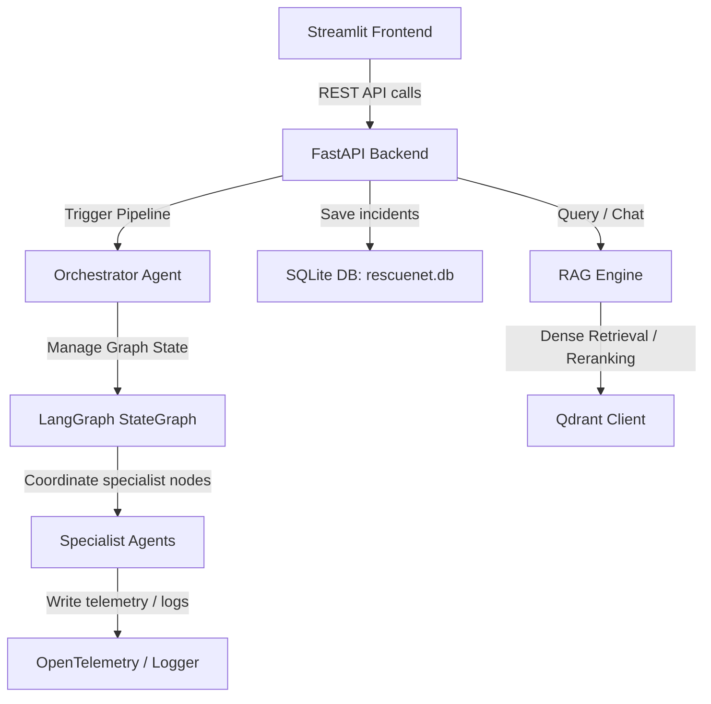

# RescueNet AI - Project Context & Work Done So Far

This file serves as a comprehensive, authoritative guide documenting the architecture, state, resolved issues, and development guide for **RescueNet AI**. Any AI model working on this repository going forward should read this file first to understand the system context.

---

## 1. System Architecture Overview

RescueNet AI is an academic-simulation multi-agent disaster response command center. It consists of a decoupled Python FastAPI backend and a Streamlit-based dashboard frontend.



### Key Components:
1. **Frontend (`frontend/app.py`)**: A Streamlit dashboard containing:
   - **Live Response**: Trigger new disaster events, view dynamic PyDeck maps (heatmaps for damage, scatter plots for priorities, arcs for routes), see tabulated recommendations, and watch a live agent execution trace.
   - **Incident History**: Logs of all historical incidents retrieved from SQLite.
   - **Live Resource State**: Current operational capacities of hospitals, shelters, active volunteers, and resource fleets.
   - **RAG Knowledge Base**: A chat-based assistant queryable for FEMA disaster guidelines and safety protocols.
2. **Backend Entrypoint (`backend/main.py`)**: FastAPI server that initializes the DB, sets up middlewares (SlowAPI rate limiting, secure headers, CORS, OpenTelemetry), and exposes the pipeline, simulation, state, and RAG routes.
3. **Orchestrator (`backend/agents/orchestrator.py`)**: The conductor of the specialist agents. It initiates the LangGraph pipeline with a thread ID, feeds in initial state parameters, executesspecialists, handles Human-in-the-Loop (HITL) pause/approvals, and structures logs for UI timeline tracing.
4. **Specialists (`backend/agents/stubs.py` & specialised modules)**:
   - **Event Detection**: Validates/refines the disaster coordinates.
   - **Damage Assessment**: Determines building damages and structural status.
   - **Rescue Prioritization**: Ranks critical infrastructure/areas needing immediate rescue.
   - **Resource Allocation**: Assigns emergency units (helicopters, boats, trucks).
   - **Route Optimization**: Maps transit safety routes.
   - **Hospital Capacity & Shelter Allocation**: Matches victims with hospitals/beds and shelters.
   - **Relief Distribution**: Computes required food, water, and medical kits.
   - **Volunteer Coordination**: Assigns volunteers to tasks based on skills.
   - **Communication**: Generates localized alerts.
   - **Prediction**: Forecasts subsequent environmental changes (wind, rainfall).
   - **Situation Reporting**: Generates a unified narrative summary of the disaster response.
5. **State Management (`backend/core/state.py` & `backend/core/base_agent.py`)**:
   - Universal state is managed via `GraphState` (inheriting from Pydantic `BaseModel`). Every specialist takes `GraphState`, processes its designated inputs, and returns a dictionary update, which LangGraph merges.

---

## 2. RAG System (Disaster Knowledge Base)

The Retrieval-Augmented Generation (RAG) system runs inside `backend/rag/` and provides authoritative guidelines during disasters.

* **Vector Database (`backend/rag/rag_engine.py`)**: Initiates a `QdrantClient`. If `QDRANT_API_KEY` is present in `.env`, it connects to the cloud Qdrant URL. Otherwise, it falls back to an **in-memory database (`:memory:`)**, which resets on backend server restarts.
* **Embedding Model**: SentenceTransformer `all-MiniLM-L6-v2` encodes text chunks into 384-dimensional dense vectors.
* **Retrieval & Reranking**:
  1. Dense vector similarity search retrieves candidate guidelines matching the user query (filtered by `disaster_type` or `agency` if provided).
  2. A Cross-Encoder model (`cross-encoder/ms-marco-MiniLM-L-6-v2`) reranks the retrieved candidates.
  3. Relevance logits are normalized using a sigmoid function into confidence/relevance scores.
  4. Best candidates are returned as a sorted list of `Citation` items containing `source_name`, `chunk_id`, `relevance_score`, and `text_snippet`.

---

## 3. Critical Bugs and Issues Resolved

### Bug 1: Secure Header Middleware Error (HTTP 500)
* **Problem**: The backend threw `AttributeError: 'Secure' object has no attribute 'framework'` on startup or request processing. The `secure` package API was updated, removing the old `.framework.fastapi()` helper.
* **Fix**: Replaced the framework-level configuration with a custom HTTP middleware decoration inside `backend/main.py` that intercepts HTTP responses and calls `secure_headers.set_headers(response)` manually.

### Bug 2: LangGraph / Pydantic GraphState Validation Crash (HTTP 500)
* **Problem**: On triggering a disaster response pipeline, the server crashed with a `ValidationError` from Pydantic. It complained that list fields like `relief_plan`, `forecasts`, `alerts`, and `streaming_events` were receiving `None` inputs (`type=list_type, input_value=None`). Because LangGraph state channels that were uninitialized defaulted to `None` inside state reconstruction, Pydantic strict validation failed.
* **Fix**: In `backend/agents/orchestrator.py`, the initial state construction was changed from a sparse dictionary update to:
  ```python
  initial_state = GraphState(
      raw_trigger=req.model_dump(),
      live_state=state,
  ).model_dump()
  ```
  This forces Pydantic to initialize all default values (such as `[]` for lists) before the state is injected into the LangGraph pregel execution loop.

### Bug 3: Frontend RAG Citation Display Crash
* **Problem**: The Streamlit interface chat tab failed to display sources and crashed when querying the RAG knowledge base. It was attempting to iterate over `data.get("context", [])`, which did not exist in the API response schema.
* **Fix**: Updated `frontend/app.py` to correctly parse `citations` according to the backend response model:
  ```python
  for i, citation in enumerate(data.get("citations", [])):
      with st.expander(f"Source {i+1}: {citation.get('source_name', 'Unknown Document')} (Score: {citation.get('relevance_score', 0):.2f})"):
          st.write(citation.get("text_snippet", ""))
  ```
  Additionally, removed duplicated RAG tab rendering blocks that had been accidentally inserted.

---

## 4. Project Repository Structure

```
rescuenet-ai_updated/
│
├── backend/
│   ├── agents/                   # Agent specialist implementations
│   │   ├── orchestrator.py       # Pipelines/Conducting logic
│   │   ├── supervisor_v2.py      # LangGraph supervisor compilation
│   │   ├── stubs.py              # Specialists bindings
│   │   └── [specialists].py      # Specialized business rules
│   │
│   ├── core/
│   │   ├── base_agent.py         # Standardized BaseAgent wrapper
│   │   ├── state.py              # Universal GraphState schemas
│   │   └── memory.py             # RedisSaver checkpointer & cache memory
│   │
│   ├── data/
│   │   └── simulated_data.py     # Base static data structures
│   │
│   ├── models/
│   │   └── schemas.py            # API request/response & SituationReport schemas
│   │
│   ├── rag/
│   │   ├── api.py                # Ingestion and query routers
│   │   ├── models.py             # Citation and RAG response schemas
│   │   └── rag_engine.py         # Dense retrieve + cross-encoder rerank
│   │
│   ├── simulation/
│   │   └── engine.py             # Tick-based disaster simulation mechanics
│   │
│   ├── database.py               # SQLite and in-memory persistence layer
│   ├── main.py                   # FastAPI backend server
│   └── requirements.txt
│
├── frontend/
│   └── app.py                    # Streamlit command dashboard
│
├── tests/                        # Automated unit & integration tests
│   ├── test_core.py
│   ├── test_memory.py
│   ├── test_rag.py
│   ├── test_simulation.py
│   └── test_supervisor.py
│
├── Dockerfile.backend
├── Dockerfile.frontend
├── docker-compose.yml
├── requirements.txt              # Standardized dependencies
├── ingest_rag.py                 # Utility script to pre-populate guidelines
└── context.md                    # THIS FILE
```

---

## 5. Development & Execution Guide

### Local Execution (Prerequisites: Python 3.10+)

1. **Install Dependencies**:
   ```bash
   pip install -r requirements.txt
   ```

2. **Run Backend (Port 8000)**:
   ```bash
   uvicorn backend.main:app --reload --port 8000
   ```

3. **Run Frontend (Port 8501)**:
   ```bash
   streamlit run frontend/app.py
   ```

4. **Populate Disaster Guidelines (RAG Ingestion)**:
   If running the backend with the in-memory fallback, ingestion must be done on every restart:
   ```bash
   python ingest_rag.py
   ```

5. **Run Tests**:
   ```bash
   pytest
   ```
