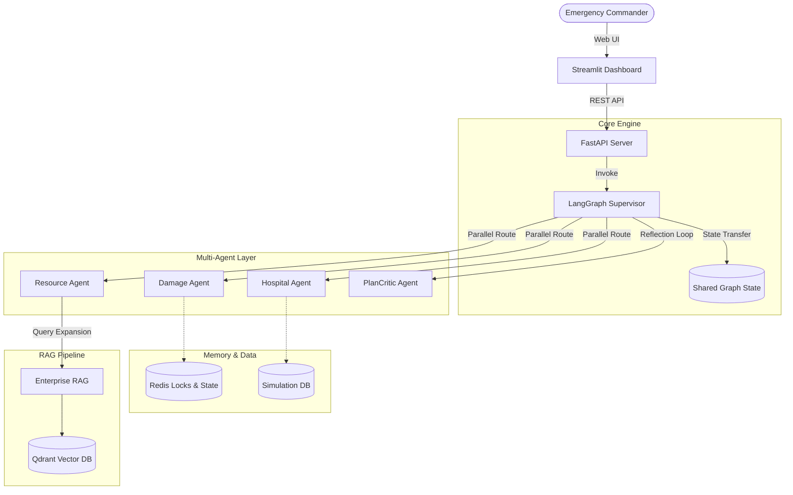

# System Architecture

RescueNet AI is built upon a distributed, stateless REST architecture backed by Redis memory and orchestrated by LangGraph. This document details how each layer interacts to form a cohesive multi-agent command center.

## 1. High-Level Architecture Flow

## 2. Component Breakdown

### 2.1 Frontend (Streamlit)
The presentation layer is fully decoupled from the core intelligence.
- **Rendering**: Employs Streamlit's reactive rendering model.
- **Mapping**: `pydeck` integrates Mapbox-style 3D layers. We specifically utilize `HeatmapLayer` for damage intensity, `ScatterplotLayer` for hospitals and shelters, and `ArcLayer` to trace logistics routing.
- **State Polling**: While Streamlit is mostly stateless, it maintains local `st.session_state` and continuously polls the backend API to fetch the latest LangGraph state dump.

### 2.2 Backend (FastAPI)
The backend acts as an asynchronous middleware gateway.
- **Server**: Uvicorn running ASGI processes.
- **Observability**: Integrates OpenTelemetry for tracing HTTP latency and structured JSON logs for Datadog ingestion.
- **Caching**: `fastapi-cache2` handles caching of high-frequency `/metrics` endpoints via Redis.
- **Routing**: API endpoints act as simple trigger mechanisms (e.g., `/api/disaster/trigger`) that spawn background tasks running the LangGraph engine.

### 2.3 Orchestrator (LangGraph)
LangGraph handles the execution topology.
- **DAG Execution**: Instead of sequential loops, agents are represented as nodes. A `Supervisor` node evaluates the `GraphState` and yields an array of next nodes to execute in parallel.
- **State Reducers**: Because multiple parallel agents mutate the `GraphState` concurrently, fields like `completed_tasks` use `Annotated[List[str], operator.add]` to prevent overwrite conflicts.

### 2.4 Agent Node Layer (LangChain)
Each specialized agent is a LangChain pipeline wrapped in a `BaseAgent` stub.
- **Pydantic Validation**: `with_structured_output()` forces the LLMs to strictly adhere to the `backend/models/schemas.py` contracts.
- **Tenacity Retries**: Exponential backoff decorators protect against transient LLM API failures.
- **Mock Tooling**: Agents utilize the `@tool` decorator to simulate data fetching (e.g., Live Traffic, Weather, Demographics) before reasoning.

### 2.5 Distributed Memory (Redis)
State management is decoupled from the compute nodes.
- **LangGraph Checkpoints**: Uses `RedisSaver` (extending `BaseCheckpointSaver`). Every node transition is written to Redis, allowing a paused graph (due to HITL) to be resumed exactly where it left off, even on a different server.
- **Distributed Locks**: To prevent over-allocation (e.g., two agents dispatching the same ambulance), agents utilize `RedisMemoryManager.acquire_lock("resource:ambulances")` before mutating the global resource pool.

### 2.6 Vector Database (Qdrant)
The RAG pipeline provides context grounding.
- **Hybrid Search**: Qdrant executes parallel BM25 (sparse) and Dense (`all-MiniLM-L6-v2`) vector searches.
- **Cross-Encoder**: Results are re-ranked using `ms-marco-MiniLM-L-6-v2` before being compressed and served to the reasoning agents.
