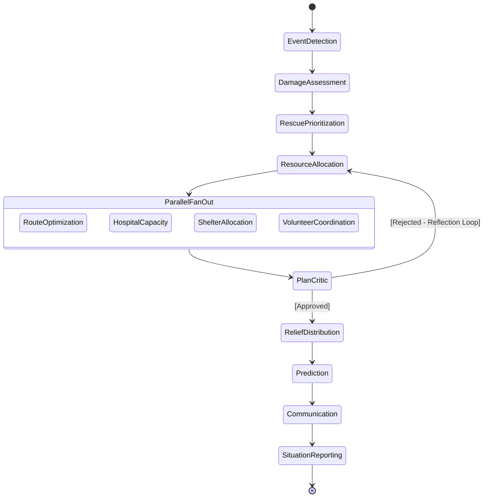

# LangGraph Workflow

The orchestrator in RescueNet AI leverages [LangGraph](https://langchain-ai.github.io/langgraph/) to model the multi-agent pipeline as a directed state graph.

## 1. Workflow State Machine

## 2. Execution Phases

### Phase 1: Sequential Initialization
The first four nodes execute sequentially because they are strict dependencies of one another.
- **Event Detection**: Cannot assess damage without knowing the disaster type.
- **Damage Assessment**: Cannot prioritize without knowing where the damage is.
- **Rescue Prioritization**: Cannot allocate resources without knowing who needs them first.
- **Resource Allocation**: Modifies global fleet counts.

### Phase 2: Parallel Fan-Out
Once resources are assigned, the system fans out. LangGraph executes these nodes concurrently across multiple OS threads (via ASGI/Uvicorn).
- **Route Optimization**: Calculating driving directions.
- **Hospital Capacity**: Booking ICU beds.
- **Shelter Allocation**: Reserving cots.
- **Volunteer Coordination**: Dispatching civilians.

### Phase 3: The Reflection Loop
After the parallel fan-out completes, the `PlanCritic` agent evaluates the combined state. 
- If the critic determines the hospital and shelter allocations are mismatched with the resources, it injects a rejection flag into the `GraphState`'s execution history.
- The `Supervisor` node evaluates this flag and forcibly routes the graph back to `ResourceAllocation`, generating a self-correction loop.

### Phase 4: Finalization
Once the Critic approves, the graph finalizes:
- **Relief Distribution**: Maps food/water logic.
- **Prediction**: Forecasts disaster spread.
- **Communication**: Broadcasts SMS alerts.
- **Situation Reporting**: Generates the markdown summary for the dashboard.

## 3. Human-in-the-Loop (HITL)

RescueNet AI configures `interrupt_before=["resource_allocation", "communication"]`.
When LangGraph reaches these edges, execution pauses. The state is serialized via `RedisSaver` and awaits manual user approval via the API (`/api/workflow/approve`). This prevents runaway LLMs from autonomously dispatching physical resources or triggering public panic without a human verifying the plan.
