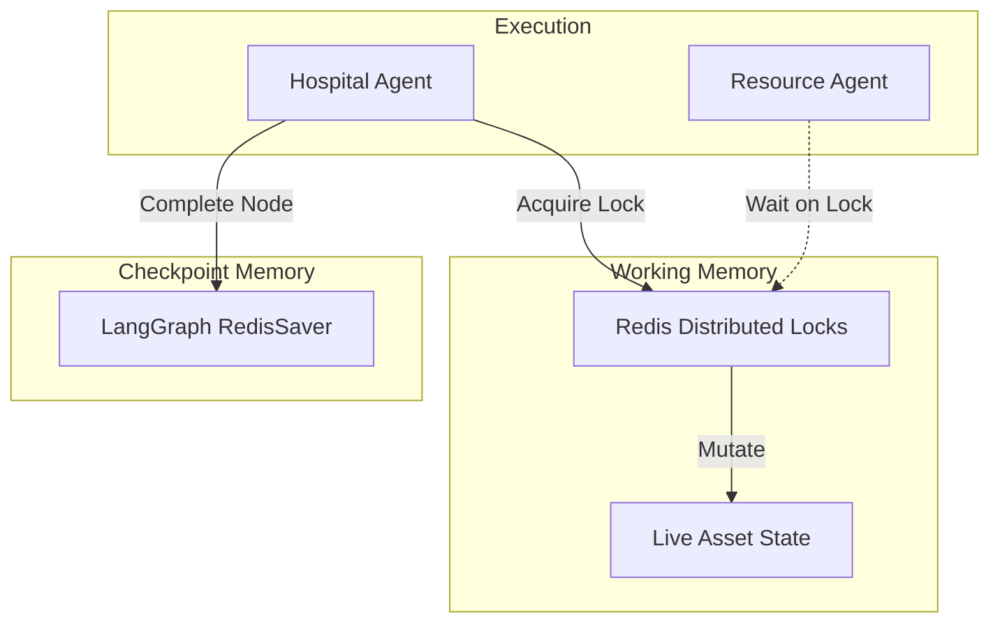

# Memory Architecture

RescueNet AI orchestrates highly concurrent parallel agents. Without a strict memory architecture, agents would hallucinate duplicate resource assignments (e.g., two agents dispatching the same ambulance).

## 1. Memory Topologies

## 2. Working Memory (Live State)
Located in `backend/core/memory.py`.
- **RedisMemoryManager**: Implements a global `acquire_lock(key, timeout)` pattern.
- When an agent decides to allocate Resource X, it acquires a lock on `resource:X`. It reads the current capacity, decrements it, writes it back, and releases the lock.
- If the Redis server is unavailable, the system safely falls back to a thread-safe Singleton `InMemoryBackend` for development environments.

## 3. Checkpoint Memory (Human-in-the-Loop)
Located in `backend/core/memory.py`.
- **RedisSaver**: Inherits from LangGraph's `BaseCheckpointSaver`.
- Serializes the entire `GraphState` into JSON (hex-encoded) and stores it in Redis Hashes (`HSET`).
- When the graph hits an `interrupt_before` node (e.g., before dispatching physical resources), execution pauses. 
- Because the checkpoint is in Redis, the FastAPI server can safely restart. An administrator can later call `/api/workflow/approve` with the `thread_id` to fetch the checkpoint from Redis and resume the graph exactly where it left off.
