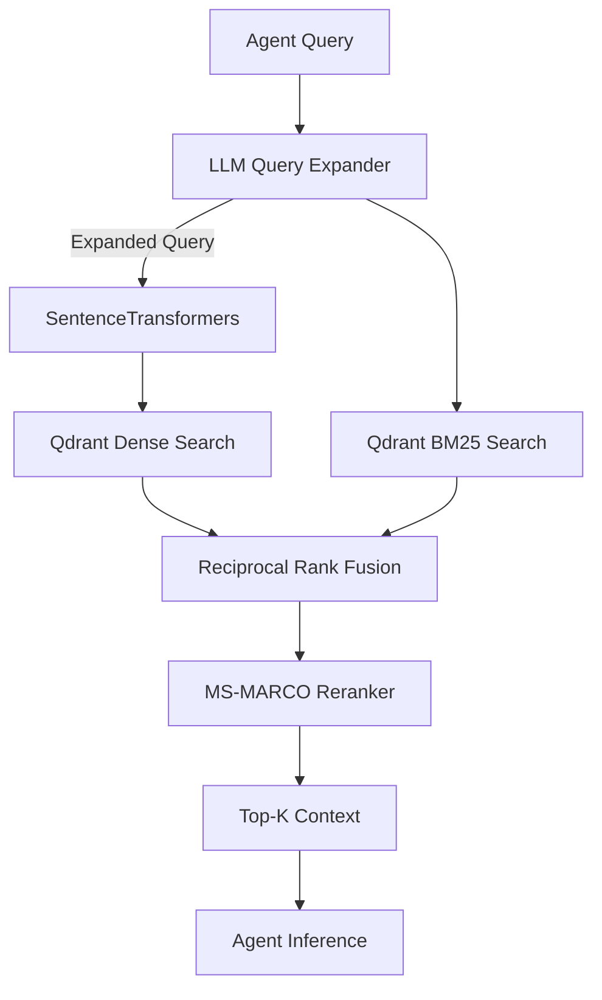

# Enterprise RAG Architecture

RescueNet AI implements a state-of-the-art Retrieval-Augmented Generation (RAG) pipeline to ground LLM reasoning in official disaster management protocols (e.g., FEMA Guidelines).

## 1. Flow Diagram

## 2. Component Details

### Query Expansion
Before hitting the database, the user query is intercepted by Groq `llama-3.1-8b-instant`. The LLM expands the query with synonyms, official FEMA terminology, and related disaster keywords. This maximizes the semantic surface area for the vector search.

### Hybrid Retrieval
We utilize Qdrant as the vector database.
- **Dense Vector Search**: `SentenceTransformer("all-MiniLM-L6-v2")` generates 384-dimensional embeddings for deep semantic matching.
- **Sparse Vector Search (BM25)**: Handles exact keyword matching for specific protocol codes or facility names that dense models often miss.

### Cross-Encoder Re-ranking
Hybrid search yields a large candidate pool. We pass the top 20 candidates through `CrossEncoder("cross-encoder/ms-marco-MiniLM-L-6-v2")`. Unlike Bi-Encoders, a Cross-Encoder evaluates the query and the document simultaneously, providing a highly accurate relevancy score. We discard anything below a `0.3` threshold.

## 3. Data Ingestion
Documents are ingested via `/api/rag/ingest`. They are chunked using Recursive Character Text Splitting to preserve context windows before being embedded and stored in the `disaster_manuals` collection in Qdrant.
