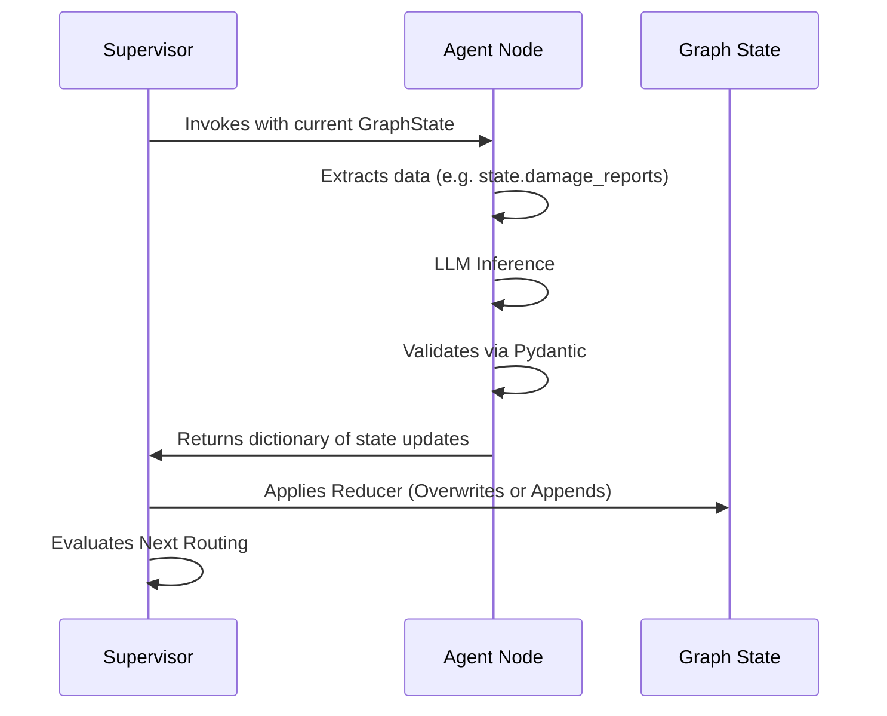

# Shared Graph State Schema

In LangGraph, all agents communicate by mutating a shared `GraphState` object. RescueNet AI uses a strict Pydantic model (`backend.core.state.GraphState`) to define this contract.

## Schema Definition

```python
class GraphState(BaseModel):
    # System & Orchestration Metadata
    correlation_id: str = Field(...)
    current_step: str = Field(...)
    supervisor_plan: List[str] = Field(...)
    parallel_tasks: List[str] = Field(...)
    completed_tasks: Annotated[List[str], operator.add] = Field(...)
    execution_history: List[Dict[str, Any]] = Field(...)
    errors: List[str] = Field(...)
    retries: Dict[str, int] = Field(...)
    
    # State flags
    needs_replanning: bool = False
    
    # Global References
    memory_references: List[Dict[str, Any]] = Field(...)
    live_state: Dict[str, Any] = Field(...)

    # Agent Data Payloads
    raw_trigger: Optional[Dict[str, Any]] = None
    event: Optional[Dict[str, Any]] = None
    damage_reports: List[Dict[str, Any]] = Field(...)
    priorities: List[Dict[str, Any]] = Field(...)
    resource_assignments: List[Dict[str, Any]] = Field(...)
    routes: List[Dict[str, Any]] = Field(...)
    hospital_assignments: List[Dict[str, Any]] = Field(...)
    shelter_assignments: List[Dict[str, Any]] = Field(...)
    volunteer_assignments: List[Dict[str, Any]] = Field(...)
    relief_plan: List[Dict[str, Any]] = Field(...)
    forecasts: List[Dict[str, Any]] = Field(...)
    alerts: List[Dict[str, Any]] = Field(...)
    narrative_summary: Optional[str] = None
```

## State Flow Mechanism



### Reducer Logic
Most fields in `GraphState` are simple overwrites. If Agent B returns `{"event": new_event}`, it replaces the old `event`.
However, `completed_tasks` uses `Annotated[List[str], operator.add]`. If parallel agents A and B both return `{"completed_tasks": ["A"]}` and `{"completed_tasks": ["B"]}`, LangGraph safely merges them into `["A", "B"]` instead of overwriting, preventing state race conditions.
